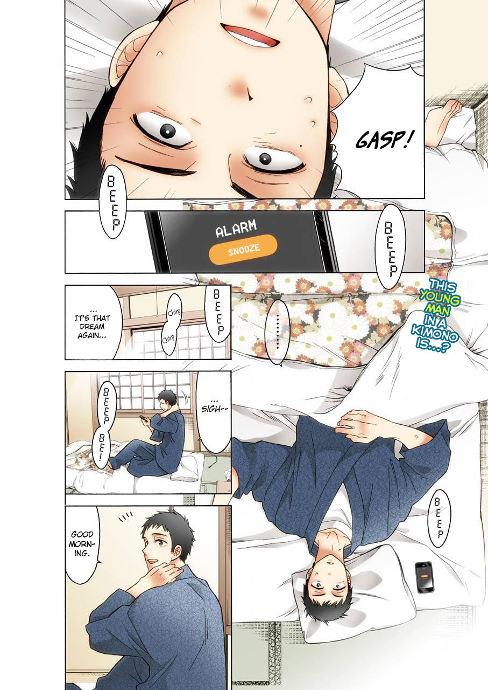
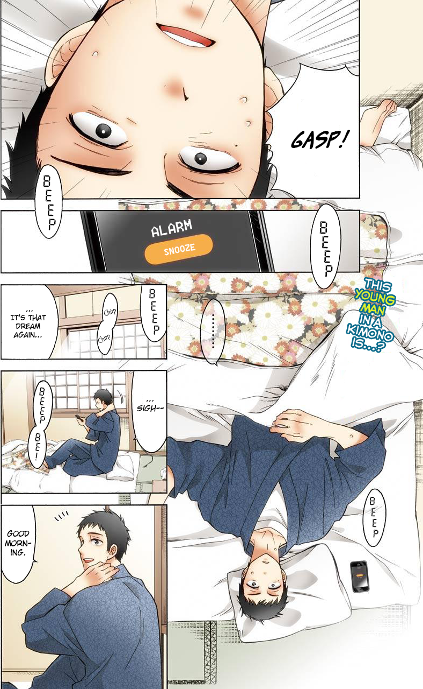
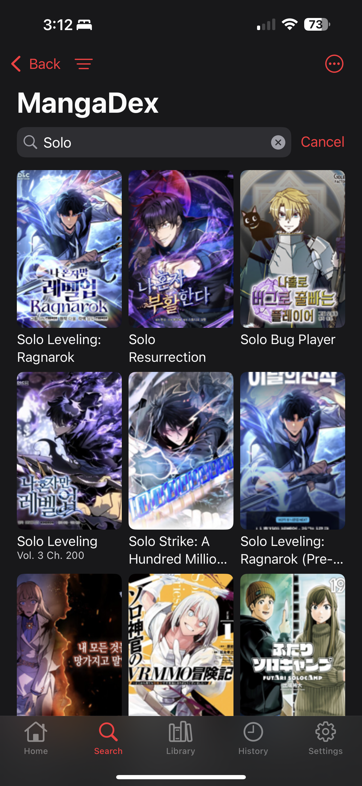

# extensions-default

Paperback 0.9 Sources and Tracker

Sources added from others:

- [Mangadex](https://github.com/paperback-community/general-extensions/tree/master) (0.9) (Improved search sorting) (Proxy server for cropping)
- [Manganato](https://github.com/TheNetsky/extensions-generic-0.8/tree/mangabox) (compatibility) (Improved search sorting) (Proxy server for cropping)
- [BatoTo](https://github.com/TheNetsky/community-extensions/tree/0.8) (0.9) (Improved search sorting) (Proxy server for cropping)
- [WeebCentral](https://github.com/GabrielCWT/gabe-extensions) (compatibility) (Improved search matching) (Proxy server for cropping)
- [Toonily](https://github.com/TheNetsky/extensions-generic-0.8/tree/madara) (0.9)
- [Komga](https://github.com/Paperback-iOS/extensions-default/tree/0.9) (compatibility)
- [Kunmanga](https://github.com/TheNetsky/extensions-generic-0.8/tree/madara) (0.9)

Trackers added from others:

- [Anilist](https://github.com/Paperback-iOS/extensions) (0.9) (Improved search sorting) (Automatic entry on new reads)

TODO:

- Rewrite stuff for 0.9, search filter requirement breaks search compatibility
- Replace input rows with stepper rows once paper implements it
- Rewrite to use the states for updates, it's just hacked together atm
- More testing

# Preview

|                           Uncropped                            |                           Cropped                            |
| :------------------------------------------------------------: | :----------------------------------------------------------: |
|  |  |

|                           Unsorted                            |                           Sorted                            |
| :-----------------------------------------------------------: | :---------------------------------------------------------: |
|  |  |
